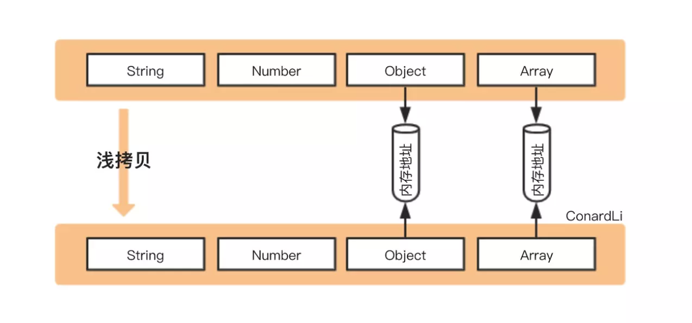
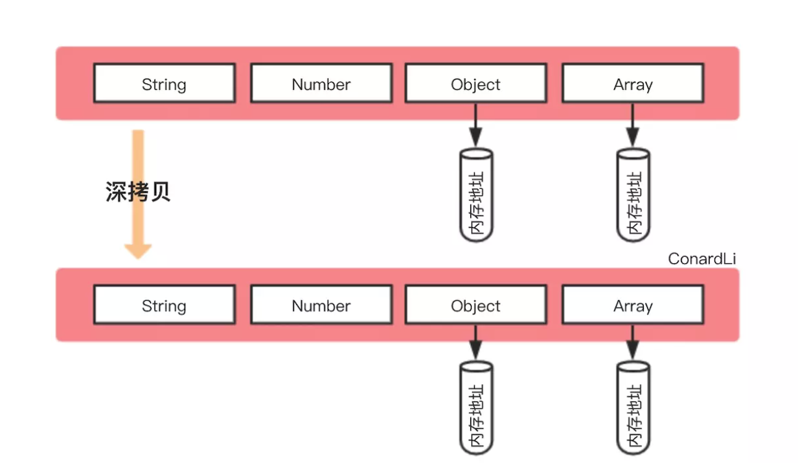
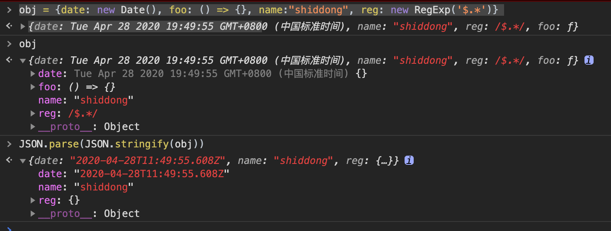
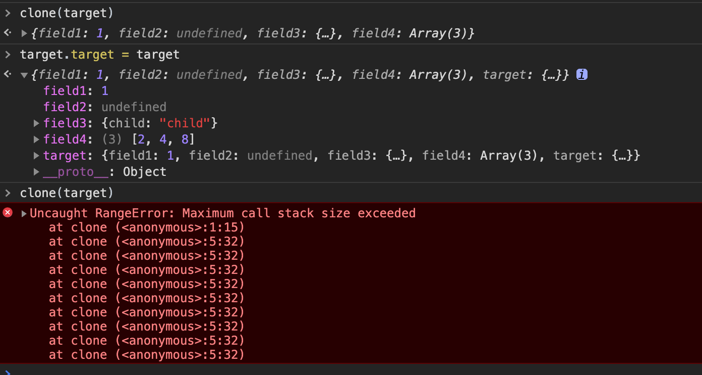

参考文档

- [如何写出一个惊艳面试官的深拷贝?](https://juejin.im/post/5d6aa4f96fb9a06b112ad5b1)


# 概念

## 浅拷贝

创建一个新对象，这个对象有着原始对象属性值的一份精确拷贝。

- 如果属性是基本类型，拷贝的就是基本类型的值；
- 如果属性是引用类型，拷贝的就是内存地址 ，所以如果其中一个对象改变了这个地址，就会影响到另一个对象。



## 深拷贝

将一个对象从内存中完整的拷贝一份出来，从**堆内存**中开辟一个新的区域存放新对象,且修改新对象不会影响原对象。



# 实现

## 乞丐版

```js
JSON.parse(JSON.stringify( obj ))
```

这种写法很简单，可以应对部分场景，但有很大的缺陷：比如拷贝其他引用类型、拷贝函数、循环引用等情况。

具体而言:

- Date类型会变成string
- 函数会丢失
- 正则为空

示例：

```js
obj = {
	date: new Date(),
  foo: () => {},
  reg: new RegExp('^\w*')
}
```

打印结果：




## 基础版本

### 只考虑对象的情况

浅拷贝实现：**创建一个新的对象，遍历需要克隆的对象，将需要克隆对象的属性依次添加到新对象上，返回。

```js
function clone(target) {
    let cloneTarget = {};
    for (const key in target) {
        cloneTarget[key] = target[key];
    }
    return cloneTarget;
};
```

所以，深拷贝的情况可以使用递归来解决，对上面的代码稍微改写，

- 如果是原始类型，无需继续拷贝，直接返回
- 如果是引用类型，创建一个新的对象，遍历需要克隆的对象，将需要克隆对象的属性执行**深拷贝后**依次添加到新对象上。

```js
function clone(target) {
    if (typeof target === 'object') {
        let cloneTarget = {};	// 这里只考虑到对象而没有考虑到数组
        for (const key in target) {
            cloneTarget[key] = clone(target[key]);
        }
        return cloneTarget;
    } else {
        return target;
    }
};
```

### 考虑数组的情况

将上述代码稍微修改一下，

```js
function clone(target) {
    if (typeof target === 'object') {
        let cloneTarget = Array.isArray(target) ? [] : {};
        for (const key in target) {
            cloneTarget[key] = clone(target[key]);
        }
        return cloneTarget;
    } else {
        return target;
    }
};
```

### 考虑循环应用的情况：使用Map

```js
const target = {
    field1: 1,
    field2: undefined,
    field3: {
        child: 'child'
    },
    field4: [2, 4, 8]
};
target.target = target;	// 循环引用会导致递归进入死循环，最终栈溢出
```

测试上面的代码，结果如下：




为了解决循环引用的问题，可以额外开辟一个存储空间，来存储当前对象和拷贝对象的对应关系，当需要拷贝当前对象时，先去存储空间中找，有没有拷贝过这个对象，如果有的话直接返回，如果没有的话继续拷贝，这样就巧妙化解的循环引用的问题。

这个存储空间，需要可以存储key-value形式的数据，且key可以是一个引用类型，我们可以选择Map这种数据结构：

- 检查map中有无克隆过的对象
- 有 - 直接返回
- 没有 - 将当前对象作为key，克隆对象作为value进行存储
- 继续克隆

```js
function clone(target, map = new Map()) {
    if (typeof target === 'object') {
        let cloneTarget = Array.isArray(target) ? [] : {};
        if (map.get(target)) {
            return map.get(target);
        }
        map.set(target, cloneTarget);
        for (const key in target) {
            cloneTarget[key] = clone(target[key], map);
        }
        return cloneTarget;
    } else {
        return target;
    }
};
```

### 考虑循环应用的情况：使用WeakMap

WeakMap 对象是一组键/值对的集合，其中的键是弱引用的。其键必须是对象，而值可以是任意的。

> 弱引用：
>
> 在计算机程序设计中，弱引用与强引用相对，是指不能确保其引用的对象不会被垃圾回收器回收的引用。 一个对象若只被弱引用所引用，则被认为是不可访问（或弱可访问）的，并因此可能在任何时刻被回收。

```js
function clone(target, map = new WeakMap()) {
    // ...
};
```

