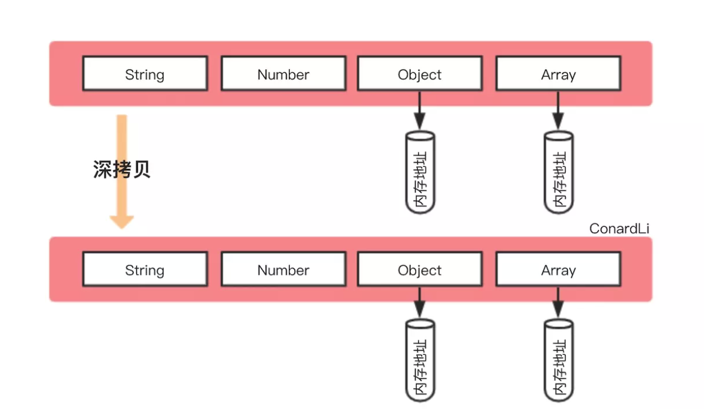

参考文档

- [如何写出一个惊艳面试官的深拷贝?](https://juejin.im/post/5d6aa4f96fb9a06b112ad5b1)

## 浅拷贝

创建一个新对象，这个对象有着原始对象属性值的一份精确拷贝。

- 如果属性是基本类型，拷贝的就是基本类型的值；
- 如果属性是引用类型，拷贝的就是内存地址 ，所以如果其中一个对象改变了这个地址，就会影响到另一个对象。

## 深拷贝

将一个对象从内存中完整的拷贝一份出来，从**堆内存**中开辟一个新的区域存放新对象,且修改新对象不会影响原对象。

