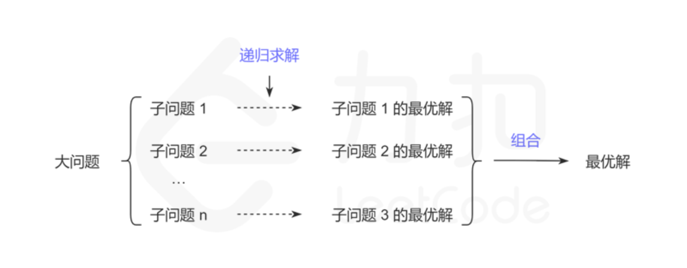

[动态规划][1]（Dynamic programming，简称 DP）是一种在数学、管理科学、计算机科学、经济学和生物信息学中使用的，通过把原问题分解为相对简单的子问题的方式求解复杂问题的方法。

动态规划常常适用于有**重叠子问题**和**最优子结构**性质的问题，动态规划方法所耗时间往往远少于朴素解法。

对动态规划，需要能够：

- 理解动态规划的基本思想
- 掌握运用动态规划解决问题的思路
- 了解动态规划算法的优缺点和问题分类
- 能够运用动态规划解决线性、前缀和、区间这三类问题

[1]: https://leetcode-cn.com/leetbook/read/dynamic-programming-1-plus

## 背景

动态规划是通过**把原问题分解为相对简单的子问题**的方式，来求解复杂问题的方法。

动态规划不是某一种具体的算法，而是一种**算法思想**：若要解一个给定问题，我们需要解其不同部分（即子问题），再根据子问题的解以得出原问题的解。

应用这种算法思想解决问题的可行性，对子问题与原问题的关系，以及子问题之间的关系这两方面有一些要求，它们分别对应了**最优子结构**和**重复子问题**。

### 最优子结构

最优子结构规定的是子问题与原问题的关系。

动态规划要解决的都是一些问题的最优解，即从很多解决问题的方案中找到最优的一个。当我们在求一个问题最优解的时候，如果可以把这个问题分解成多个子问题，然后递归地找到每个子问题的最优解，最后通过一定的数学方法对各个子问题的最优解进行组合得出最终的结果。总结来说就是一个问题的最优解是由它的各个子问题的最优解决定的。

将子问题的解进行组合可以得到原问题的解是动态规划可行性的关键。在解题中一般用状态转移方程描述这种组合。例如原问题的解为 f(n)，其中 f(n) 也叫状态。状态转移方程 f(n) = f(n - 1) + f(n - 2) 描述了一种原问题与子问题的组合关系 。在原问题上有一些选择，不同选择可能对应不同的子问题或者不同的组合方式。例如

$$
f(n) = \left\{ \begin{array}{lr} f(n - 1) + f(n - 2) \qquad n = 2k \\ f(n - 1) \qquad\qquad\qquad n = 2k + 1 \\ \end{array} \right.
$$

> n=2k 和 n = 2k + 1 对应了原问题 n 上不同的选择，分别对应了不同的子问题和组合方式。

找到了最优子结构，也就能推导出一个状态转移方程 f(n)，通过这个状态转移方程，我们能很快的写出问题的递归实现方法。

### 重复子问题

重复子问题规定的是子问题与子问题的关系。

当我们在递归地寻找每个子问题的最优解的时候，有可能会会重复地遇到一些更小的子问题，而且这些子问题会重叠地出现在子问题里，出现这样的情况，会有很多重复的计算，动态规划可以保证每个重叠的子问题只会被求解一次。当重复的问题很多的时候，动态规划可以减少很多重复的计算。

重复子问题不是保证解的正确性必须的，但是如果递归求解子问题时，没有出现重复子问题，则没有必要用动态规划，直接普通的递归就可以了。

例如，斐波那契问题的状态转移方程 f(n) = f(n - 1) + f(n - 2)。在求 f(5) 时，需要先求子问题 f(4) 和 f(3)，得到结果后再组合成原问题 f(5) 的解。递归地求 f(4) 时，又要先求子问题 f(3) 和 f(2) ，这里的 f(3) 与求 f(5) 时的子问题重复了。

## 基本思想

动态规划背后的基本思想非常简单。大致上，若要解一个给定问题，我们需要解其不同部分（即子问题），再根据子问题的解以得出原问题的解。动态规划往往用于优化递归问题，例如斐波那契数列，如果运用递归的方式来求解会重复计算很多相同的子问题，利用动态规划的思想可以减少计算量。

通常许多子问题非常相似，为此动态规划法试图仅仅解决每个子问题一次，具有天然剪枝的功能，从而减少计算量：一旦某个给定子问题的解已经算出，则将其记忆化存储，以便下次需要同一个子问题解之时直接查表。这种做法在重复子问题的数目关于输入的规模呈指数增长时特别有用。

### 解决动态规划问题的核心

核心：找出子问题及其子问题与原问题的关系。

找到了子问题以及子问题与原问题的关系，就可以递归地求解子问题了。但重叠的子问题使得直接递归会有很多重复计算，于是就想到记忆化递归法：若能事先确定子问题的范围就可以建表存储子问题的答案。

动态规划算法中关于最优子结构和重复子问题的理解的关键点：

1. 证明问题的方案中包含一种选择，选择之后留下一个或多个子问题
2. 设计子问题的递归描述方式
3. 证明对原问题的最优解包括了对所有子问题的最优解
4. 证明子问题是重叠的（这一步不是动态规划正确性必需的，但是如果子问题无重叠，则效率与一般递归是相同的）

## 思考过程

> 考虑能否将问题规模减小

### 1.递归

### 2.自顶向下（记忆化）

### 3.自底向上（迭代）

## 问题分类

### 1.线性动态规划

### 2.前缀和

### 3.区间动态规划
