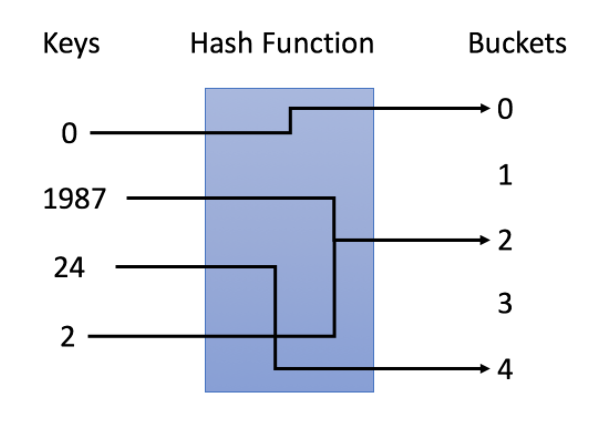
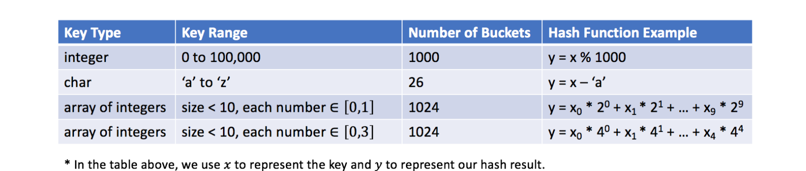

[哈希表][1]（Hash Table，也叫散列表）是一种使用哈希函数组织数据，以支持快速**插入**和**搜索**的数据结构。

有两种不同类型的哈希表：哈希集合和哈希映射。

- 哈希集合是集合数据结构的实现之一，用于存储非重复值。
- 哈希映射是映射 数据结构的实现之一，用于存储(key, value)键值对。

通过选择合适的哈希函数，哈希表可以在插入和搜索方面实现出色的性能。

在哈希表中主要思考以下问题：

- 哈希表的原理是什么？
- 如何设计哈希表？
- 如何使用哈希集来解决与重复相关的问题？
- 如何使用哈希映射按键聚合信息？
- 如何在使用哈希表时设计正确的键？

[1]: https://leetcode-cn.com/leetbook/read/hash-table

## 哈希表的原理

哈希表的关键思想是使用哈希函数将键映射到存储桶。更确切地说，

- 当我们插入一个新的键时，哈希函数将决定该键应该分配到哪个桶中，并将该键存储在相应的桶中；
- 当我们想要搜索一个键时，哈希表将使用相同的哈希函数来查找对应的桶，并只在特定的桶中进行搜索。

### 示例

在示例中，我们使用 y = x ％ 5 作为哈希函数，表示其中 x 是键值，y 是分配的桶的索引。
让我们使用这个例子来完成插入和搜索策略：

- 插入：我们通过哈希函数解析键，将它们映射到相应的桶中。
  - 例如，1987 分配给桶 2，而 24 分配给桶 4。
- 搜索：我们通过相同的哈希函数解析键，并仅在特定存储桶中搜索。
  - 如果我们搜索 1987，我们将使用相同的哈希函数将 1987 映射到 2。因此我们在桶 2 中搜索，我们在那个桶中成功找到了 1987。
  - 如果我们搜索 23，将映射 23 到 3，并在桶 3 中搜索。我们发现 23 不在桶 3 中，这意味着 23 不在哈希表中。



## 设计哈希表的关键因素

### 1.哈希函数

如上面的示例，使用 y = x % 5 作为哈希函数，其中 x 是键值，y 是分配的桶的索引。

哈希函数的设计是一个开放的问题。其思想是尽可能将键分配到桶中，理想情况下，完美的哈希函数将是键和桶之间的一对一映射。然而，在大多数情况下，哈希函数并不完美，它需要在桶的数量和桶的容量之间进行权衡。



### 2.冲突解决

理想情况下，如果我们的哈希函数是完美的一对一映射，我们将不需要处理冲突。不幸的是，在大多数情况下，冲突几乎是不可避免的。例如，在我们之前的哈希函数 y = x ％ 5 中，1987 和 2 都分配给了桶 2，这就是一个冲突。

冲突解决算法应该解决以下几个问题：

- 如何组织在同一个桶中的值？
- 如果为同一个桶分配了太多的值，该怎么办？
- 如何在特定的桶中搜索目标值？

根据我们的哈希函数，这些问题与**桶的容量**和**可能映射到同一个桶的键的数目**有关。

让我们假设存储最大键数的桶有 N 个键，通常，

- 如果 N 是常数且很小，我们可以简单地使用一个数组将键存储在同一个桶中。
- 如果 N 是可变的或很大，我们可能需要使用高度平衡的二叉树来代替。

## 设计哈希集合

设计应该包含以下的功能：

- add(value)：向哈希集合中插入一个值。
- contains(value) ：返回哈希集合中是否存在这个值。
- remove(value)：将给定值从哈希集合中删除。如果哈希集合中没有这个值，什么也不做。

> [705: design-hashset](https://leetcode-cn.com/problems/design-hashset)

使用 object 是一种最简单的实现方式。

```js
class MyHashSet {
  obj = {};

  add = (key) => {
    this.obj[key] = true;
  };

  remove = (key) => {
    this.obj[key] = undefined;
  };

  contains = (key) => {
    return !!this.obj[key];
  };
}
```

## 设计哈希映射

设计应该包含以下的功能

- put(key, value)：向哈希映射中插入(键,值)的数值对。如果键对应的值已经存在，更新这个值。
- get(key)：返回给定的键所对应的值，如果映射中不包含这个键，返回-1。
- remove(key)：如果映射中存在这个键，删除这个数值对。

> [706: design-hashmap](https://leetcode-cn.com/problems/design-hashmap)

解答方式同上，

```js
class MyHashMap {
  obj = {};

  put = (key, value) => {
    this.obj[key] = value;
  };

  get = (key) => {
    return this.obj[key] !== undefined ? this.obj[key] : -1;
  };

  remove = (key) => {
    this.obj[key] = undefined;
  };
}
```

## 复杂度分析

如果总共有 M 个键，那么在使用哈希表时，可以很容易地达到 O(M) 的空间复杂度。但是哈希表的时间复杂度与设计有很强的关系。

我们中的大多数人可能已经在每个桶中使用数组来将值存储在同一个桶中，

- 理想情况下，桶的大小足够小时，可以看作是一个常数。插入和搜索的时间复杂度都是 O(1)。
- 但在最坏的情况下，桶大小的最大值将为 N。插入时时间复杂度为 O(1)，搜索时为 O(N)。

## 内置哈希表的原理

内置哈希表的典型设计是：

- 键值可以是任何**可哈希化**的类型。并且属于可哈希类型的值将具有**哈希码**。此哈希码将用于映射函数以获取存储区索引。
- 每个桶包含一个数组，用于在初始时将所有值存储在同一个桶中。
- 如果在同一个桶中有太多的值，这些值将被保留在一个高度平衡的二叉树搜索树中。

插入和搜索的平均时间复杂度仍为 O(1)。最坏情况下插入和搜索的时间复杂度是 O(logN)，使用高度平衡的 BST。这是在插入和搜索之间的一种权衡。

## 题目分类

### 1.哈希集合

[136.只出现一次的数字](./136.只出现一次的数字)

[202.快乐数](./202.快乐数)

### 2.哈希映射

### 3.设计键

### 4.其它
