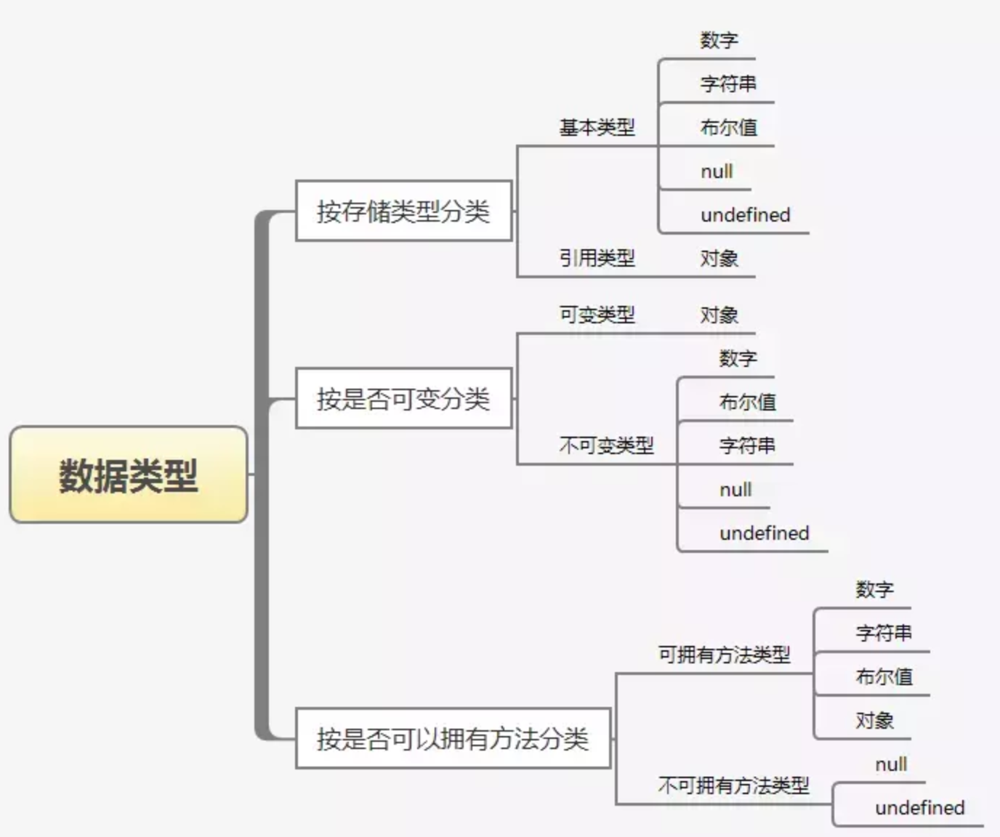

# 类型

## 1、JavaScript 中有哪些类型？

6 中数据类型：数字 number、字符串 string、布尔值 boolean、undefined、null、（引用类型）对象 Object

对象类型包括：数组 Array、函数 Function

两个特殊对象：正则 RegExp、日期 Date

### 2、在内存中的存储方式？

堆、栈

为什么 Object 要用堆存储？ => 占用空间大，JS 切换栈空间的上下文受影响

### 3、ES6 扩展了哪些类型？

Symbol、

Map、Set

Promise 对象、Proxy 对象、Reflect 对象

TypedArray

ArrayBuffer

DataView

为什么采用 let 和 const，而不用 var

### 4、TS 有扩展了哪些类型？

枚举 enum

元祖 tuple

never、any、void

如何做到类型断言的？

### 5、有哪些类型检测的方式、区别？
